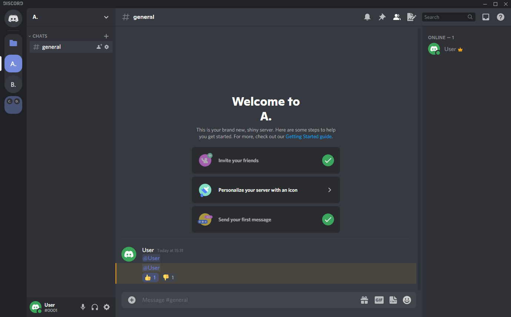

# Old Theme

* Adds some of the old Discord design, namely:
  * Old reactions
  * Old mentions
  * Old Discord Text on the Top right
  * Old Discord Logo for the Home Button
  * Old Folder Style (you can still give them colors)

